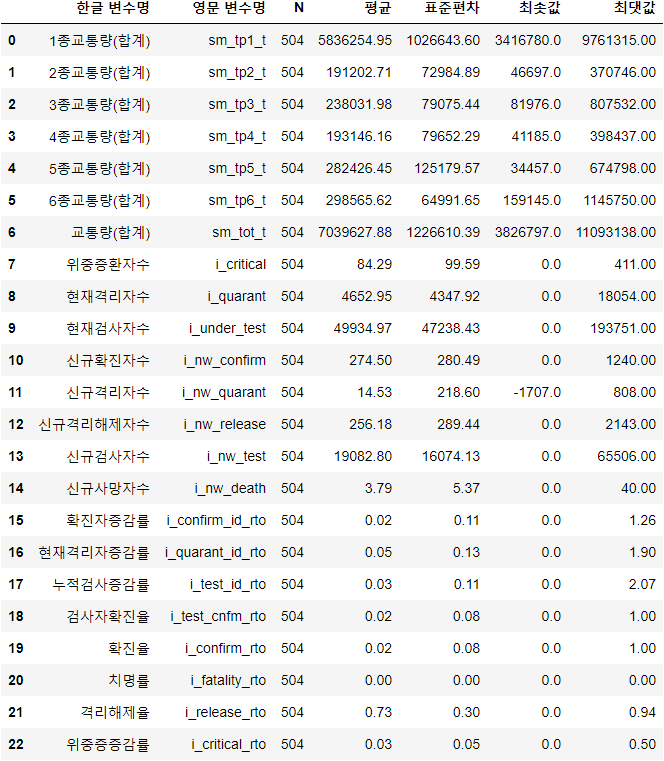

# StatisticDataAnalysis  
서강대 정보통신대학원 통계기반 데이터분석 조별과제  

# Dev INFO
### python ver : 3.6

# INFO  
### 조명 : 일석이조(2조)  
### 조원 : 김민석(조장), 김지윤, 김보영, 조세원, 정동문  
### 논문 주제 : COVID-19 확산의 이동성 효과 : TCS 데이터를 활용한 사회·경제적 효과 분석을 중심으로  
### 논문 URL : http://lps3.www.dbpia.co.kr.libproxy.sogang.ac.kr/pdf/pdfView.do?nodeId=NODE10485870  
### 데이터 출처 :     
#### 1) 교통량: http://data.ex.co.kr  
#### 2) 코로나-19 현황 : https://github.com/jooeungen/coronaboard_kr  

### 데이터 수집 기간 :    
#### 1) 교통량 : 20200101 ~ 20210531  
#### 2) 코로나-19 현황 : 20200101 ~ 20210518  

### 데이터 인덱스
#### 1) traffic  
  

#### 2) traffic  
|집계일자|영업소코드|영업소명|입출구구분코드|입출구명|TCS하이패스구분코드|TCS하이패스명  
|고속도로운영기관구분코드|고속도로운영기관명|영업형태구분코드|영업형태명  
|1종교통량|2종교통량|3종교통량|4종교통량|5종교통량|6종교통량|총교통량|

### 기술통계 출력
  